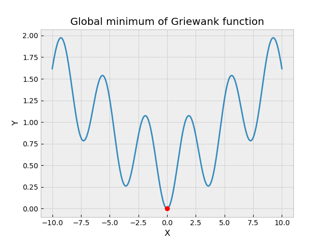
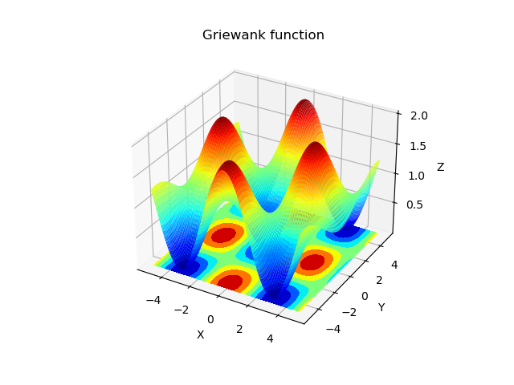
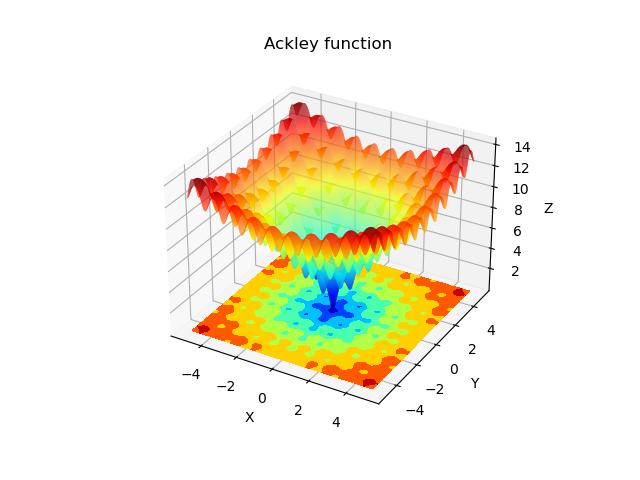
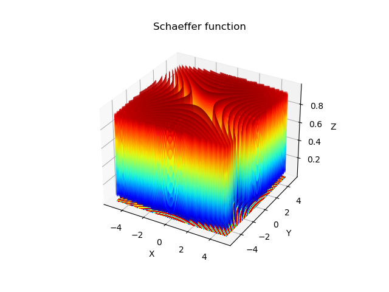
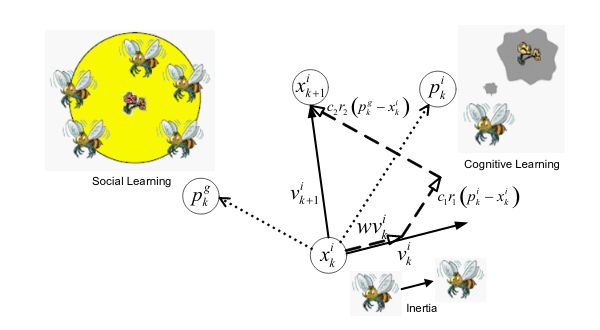
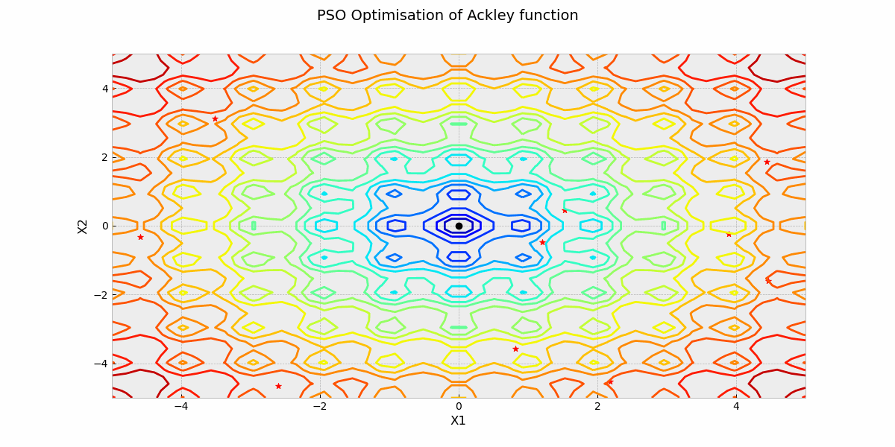
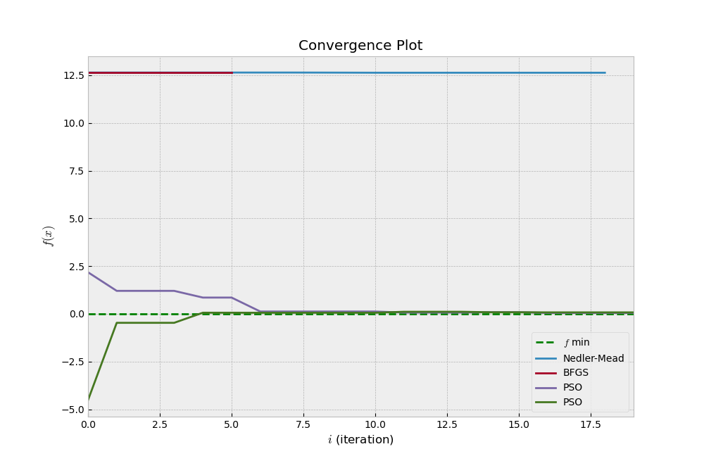
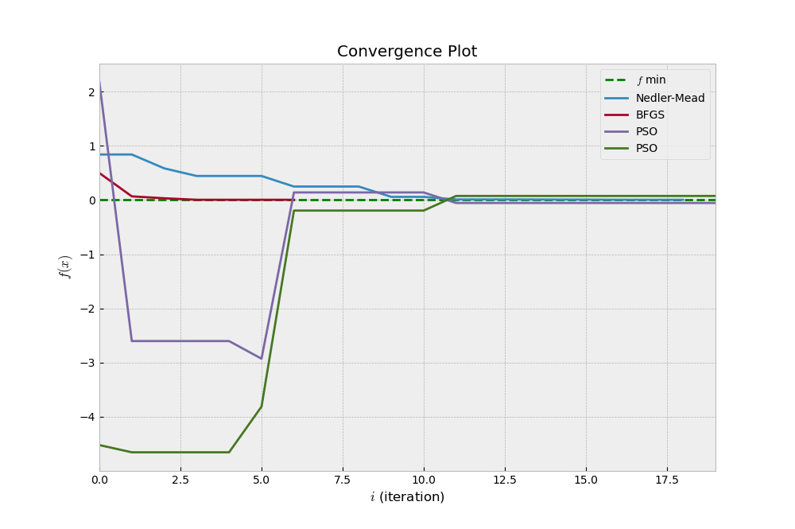
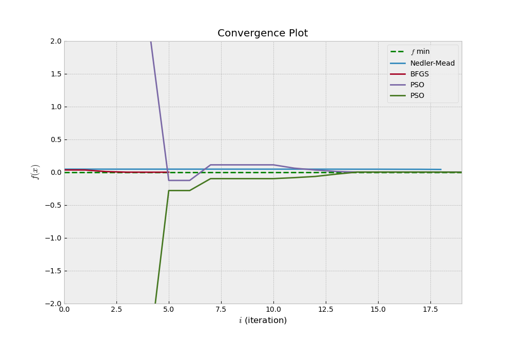
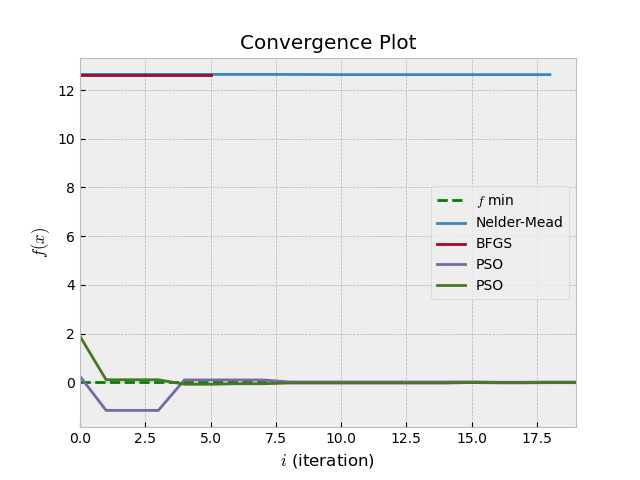

Problem setting 
================

Classic optimization methods such as gradient descent and quasi-newton methods perform well
for unimodal optimisation. However, these classic methods fail to find the global optimum 
whenever the function to optimise has discontinuities or multiple local optima.

Below are some examples of these functions that are widely used to test optimisation algorithms.

Figure 1
                                                                                                                                                              
                                                                                                                                                                                                                                                       

                                                                                         
1.  Griewank Function          

                                                                                        
2.  Ackley Function    
                                                            

                                                                                        
3.  Schaeffer Function                                                                  

What optimisation algorithm when the objective function is not differentiable?

Derivative free optimisation
----------------------------
Several derivative free optimisation also called black-box optimisation aim to solve the above problem. 
The three main classes of black-box algorithm are :

* Direct Algorithms
* Stochastic Algorithms
* Population Algorithms

The focus of this project will be on a population algorithm called Particle Swarm Optimisation.

Particle Swarm Optimisation
===========================
Particle swarm optimization (PSO), first proposed by Kennedy and Eberhart in 1995 is one of the most popular swarm-intelligence-based algorithms. 
This relatively new, modern, and powerful method of optimization has been empirically shown to perform well on many of optimization problems from physical processes to economics.
PSO takes its inspiration in the social behavior of animals. It is based on group communication and sharing of individual knowledge when a group of birds or insects searches food. 
Each member adjusts its movement according to self experience and social interaction. If any member discovers a desirable path to go, the rest of the members will follow quickly. 
Thus, PSO is a simple, flexible and efficient algorithm compared to other optimisation methods.

PSO Algorithm
-------------

PSO algorithm searches the space of an objective function by adjusting the trajectories of individual agents, called particles, as the piecewise paths formed by positional vectors 
in a quasi-stochastic manner. Each particle is attracted toward the position of the current global best  and its own best location in history, while at the same time it has a tendency
to move randomly. When a particle finds a location that is better than any previously found locations, updates that location as the new current best for particle i. 
There is a current best for all n particles at any time t during iterations. The aim is to find the global best among all the current best solutions until the objective no longer improves
or after a certain number of iterations. 

The update of particle’s position is given by:

 .. math:: 

    x^{i}_{k} + 1 =  x^{i}_{k} + v^{i}_{k+1} + ∆t

The velocity of the particle is given by:

 .. math:: 

    v^{i}_{k+1} = w v^{i}_{k} + c_{1} r_{1} \frac{(p^{i}_{k} − x^{i}_{k})}{∆t} + c_{2} r_{2} \frac{(p^{g}_{k} − x^{i}_{k})}{∆t}

 * :math:`r_{1}` and :math:`r_{2}` are random numbers in the interval [0,1]
 * :math:`p^{i}_{k}` is particle i best position 
 * :math:`p^{g}_{k}` is the swarm’s best particle position at iteration k
 * :math:`c_{1}` is the parameter for the confidence in itself and :math:`c_{2}` is the social parameter 
 * w is the inertia weight    
      

Results
=======

Figure 2 

* a) Ackley function 

* b) Griewank function 

.. image:: ../source/data/PSO_griewank.gif  

* c) Schaeffer function

.. image:: ../source/data/PSO_schaeffer.gif  

 

We observe that Nedler-Mead and BFGS converge faster towards the global minimum than PSO 
if the initial guess is close to the global minimum. Otherwise, it gets stuck in a local minimum (Figure 2a).

Parameter tuning
---------------------
* Population size
The algorithm works well for a small number of particles n=10.

* Weight factor

From the convergence plots and animations above, we see that the particles overshoot the best regions because of too much momentum.
This is likely due to the fixed inertia. In order to control global search, it is better to update dynamically the inertia weight factor.
A larger inertia weight factor tends towards global exploration, while a smaller inertia weight factor tends toward fine-tuning 
of the local search area.

The adaptive inertia weight factor is defined as:

 .. math::
    \{ w_{min} + \frac{w_{max}-w_{min}}{f_{avg}-f_{min}} , f < f_{avg}
.. math::
    \ w_ {max}                                          , f > f_{avg}
    
* :math:`w_{max}` and :math:`w_{min}` denote the maximum and minimum of w 
* f is the current objective value of the particle
* :math:`f_{avg}` and :math:`f_{min}` are the average and minimum objective values of all particles

w varies such that particles with low objective values can be protected while particles with objective values over average
will be disrupted ( `Shi and Eberhart`_ ).

.. _Shi and Eberhart: https://ieeexplore.ieee.org/stamp/stamp.jsp?tp=&arnumber=785511

Below is the result for the Ackley function after implementing the adaptive weight factor.

* Unconstrained PSO

* PS0 with adaptive weight factor update 

We observe that the particles converge faster towards the global minimum with the dynamic weight factor update. 
There is a better balance between exploration and exploitation.
